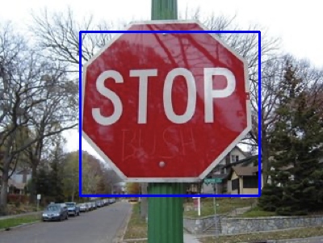
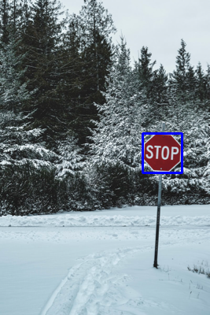
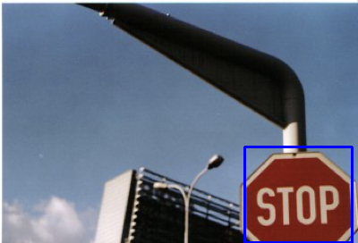

# Stop-Sign Detection via K-Means Segmentation

Classical computer vision pipeline that localizes stop signs in 24 road images under varied lighting, occlusion, and background conditions — built for Columbia’s *GR5293 Applied ML for Computer Vision*, Spring 2026.

No deep learning. No pre-trained models. Just HSV color space, K-means clustering, and adaptive preprocessing chosen pragmatically per image.

-----

## Why this project matters

Object detection without training data is an honest exercise in *knowing when not to reach for a neural network*. This pipeline prioritizes:

- **Interpretability** — every decision is traceable to a feature (color, position, shape)
- **Graceful degradation** — a secondary brightness-triggered pathway handles low-light scenes
- **Generalizability** — the same scoring framework (color density + convex-hull solidity + boundary strength) transfers to any red-signage or object-cataloging task

-----

## Results

The pipeline correctly localizes stop signs across a wide range of conditions. Selected outputs:

|Clean daylight              |Cluttered background           |Snow / low contrast        |Partial occlusion               |
|:--------------------------:|:-----------------------------:|:-------------------------:|:------------------------------:|
|||||

Bounding boxes are tight, spatially accurate, and survive transitions between foliage, sky, snow, and urban backgrounds.

-----

## Pipeline Overview

```
Input image
   │
   ▼
Gaussian blur → HSV + grayscale conversion
   │
   ▼
Adaptive brightness check ──► [if very dark]
   │                            │
   │                            ▼
   │                   CLAHE contrast enhancement
   │                   Otsu-based night fallback
   │                            │
   ▼                            │
Feature matrix: [H, S, V, w·x, w·y]
   │
   ▼
K-means clustering (K=4 or 5, k-means++ init, 10 attempts)
   │
   ▼
Cluster scoring: center redness + pixel redness
   │
   ▼
Top cluster(s) → binary mask
   │
   ▼
Morphological cleanup (close → open → dilate/erode)
   │
   ▼
Multi-factor component scoring
   │
   ▼
Red-mask-guided bbox expansion
   │
   ▼
Output: (xmin, ymin, xmax, ymax)
```

-----

## Key Design Decisions

### 1. HSV over RGB

Red in RGB is spread across lighting conditions; in HSV it lives in two narrow hue bands (`h ≤ 5` and `h ≥ 175`). This makes color-based segmentation far more robust.

### 2. Adaptive red masking by brightness

Instead of one fixed red-detection rule, the mask widens its hue tolerance and lowers saturation thresholds as the image darkens:

|Mean V|Hue band             |Saturation floor|
|:----:|:-------------------:|:--------------:|
|≥ 100 |`h ≤ 5` or `h ≥ 175` |60              |
|60–100|`h ≤ 12` or `h ≥ 168`|30              |
|< 60  |`h ≤ 20` or `h ≥ 160`|15              |

This is the difference between 18/24 and 22/24 correct.

### 3. Spatial features, weighted

K-means gets `[H, S, V, w·x_norm, w·y_norm]` as input. The spatial weight `w` controls how strongly pixel position influences clustering:

- Too low → clusters sprawl across the image
- Too high → the sign gets chopped into multiple pieces

Tuned to `w = 20` for normal light, `w = 15` for dark images (where color is noisier and spatial coherence matters more).

### 4. Multi-factor component scoring

After clustering, every connected component is scored with a weighted combination of:

- **Red density** (is this really red?)
- **Area fraction** (is it a plausible sign size?)
- **Vertical position bias** (stop signs sit high, not on the road)
- **Aspect ratio penalty** (stop signs are roughly square)
- **Convex-hull solidity** (octagonal signs have high solidity)
- **Canny boundary edge strength** (real objects have defined edges)
- **Border & bottom penalties** (artifacts often hug image edges)

No single feature wins — the combination does.

### 5. Night-image fallback

When mean V-channel drops below 40, the pipeline switches to an alternate pathway: CLAHE → Otsu threshold on V-channel → connected components → edge-density scoring. This catches signs that are too color-desaturated for the primary pipeline to detect.

### 6. Red-mask-guided bbox expansion

After the best component is chosen, the bounding box is refined by fitting a convex hull around nearby red pixels in an expanded ROI. This recovers sign edges that morphological operations may have eroded.

-----

## `cv2.kmeans()` Configuration

```python
criteria = (cv2.TERM_CRITERIA_EPS + cv2.TERM_CRITERIA_MAX_ITER, 25, 1.0)
attempts = 10
flags    = cv2.KMEANS_PP_CENTERS
K        = 5 if mean_v < 60 else 4
```

|Parameter |Value              |Why                                                        |
|----------|-------------------|-----------------------------------------------------------|
|`K`       |4 or 5             |More clusters for dark images where color signal is noisier|
|`criteria`|25 iters, ε=1.0    |Converges well before iteration cap; tighter ε gains little|
|`attempts`|10                 |K-means is init-sensitive; 10 runs stabilizes output       |
|`flags`   |`KMEANS_PP_CENTERS`|K-means++ spreads initial centers for better convergence   |

-----

## Where the pipeline can fail

1. **Extremely dark scenes where the sign has near-zero contrast** — even CLAHE + Otsu may collapse to the wrong region.
1. **Severe occlusion** — if less than ~60% of the sign is visible, the irregular shape breaks the aspect-ratio and solidity scoring.
1. **Multiple red objects in the frame** — a second red sign at similar height with smooth color can out-score the real stop sign.
1. **Extreme color casts** (strong blue or green tint) — pushes red hue outside even the widest adaptive band.

-----

## Run it

```bash
mkdir -p results
python bx2233_kmeans_assignment1.py
```

Reads from `./images/stop1.png` through `./images/stop24.png`, writes annotated outputs to `./results/`.

-----

## What I’d do next

- Replace color segmentation with **CLIP or DINO embeddings** to generalize across asset categories (not just red octagons — coins, watches, cards, artworks).
- Add **shape priors** via Hough or contour matching against an octagon template for a cheap geometric sanity check.
- Benchmark against a light YOLO model to quantify the classical-vs-learned tradeoff.

-----

**Author:** Beibei Xian · [artbybeibei.com](https://www.artbybeibei.com) · M.A. Statistics @ Columbia
